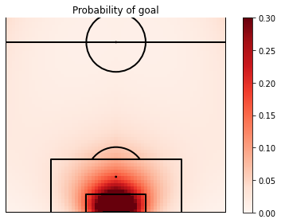

# Data Science Portfolio
### Personal Profile
Graduate Mechanical Engineering Student with a strong academic record. Excellent communication skills with a deep curiosity for innovative technical solutions gained through work experience and extra reading. Seeking a graduate role as a Data Scientist. 

### Education
- University of Southampton Mechanical Engineering (MEng) First Class Honours (_2019-2023_)
- DataCamp Data Scientist Qualification (_2023_)
- DataCamp Machine Learning Qualification (_2023_)
  
### [Project 1: Using Bayesian Statistics to find the Best Test XI](https://github.com/jkrishna12/Cricket_Bayesian_Average)
- Used requests and BeautifulSoup libraries to scrape data from website and turn into a Pandas dataframe
- Cleaned dataframe removing missing/eroneous values
- Performed feature engineering to generate relevant data needed for analysis
- Implemented a bayesian analysis of a normal model with multiple observations
- Matplotlib and Seaborn libraries used to create visualisation of data
- Arviz used to calculate the 90% HDI of the posterior distribution

 

### [Project 2: Spam Text Classifier](https://github.com/jkrishna12/TextSpamClassifier)
- Used Spacy and WordCloud to create informative visualisation for exploratory data analysis
- Preprocessed text data by lemmatising tokens and removing stopwords
- Leveraged RegEx to keep relevant tokens
- Implemented MultinomialNB and LinearSVC models from Sci-kit Learn
- Created confusion matrix and ROC curve to evaluate model performance
- Performed hyperparameter tuning with final model achieving an accuracy of 98%

### [Project 3: University Data Analysis](https://github.com/jkrishna12/University-Data-Analysis)
-	Analysed dataset using Pandas to find missing or erroneous data, replacing with appropriate values
-	Demonstrated skills in Seaborn and Matplotlib to show visualisations between key variables
-	Performed feature engineering to create relevant features for machine learning
-	Implemented and evaluated machine learning algorithms from Scikit-Learn to see which was most suitable for the business problem

### [Project 4: Healthcare Data Statistical Analysis](https://github.com/jkrishna12/Healthcare-Data-Statistical-Analysis)
- Created visualisations using seaborn to support findings from hypothesis test
- Used statsmodels to implement a two sample proportional z test
- Leveraged Pingouin library to perform chi2 independence and normality test
- Conducted Wilcoxon Mann Whitney test to compare distributions

### [Project 5: Statistical Football Models](https://github.com/jkrishna12/football_models)
- Used Pandas to manipulate Wyscout datasets to create relevant features for the statisitcal models
- Leveraged XGBoostClassifier and Linear Regression model to create an action based expected threat model
- Developed an expected goals model using logistic regression taking the angle and distance of a shot as features

